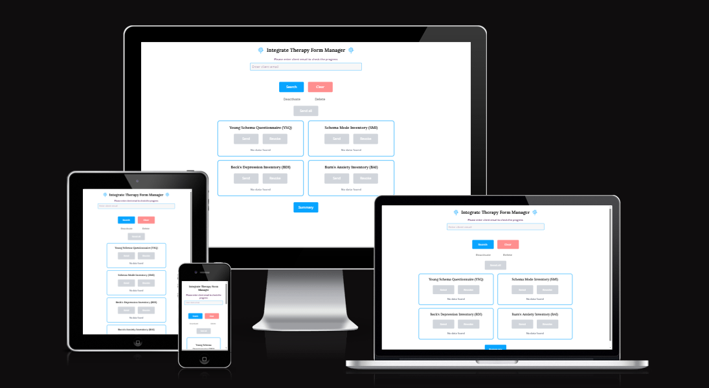

# Integrate Therapy Form Manager

                

# Introduction

This project was developed for a sole-trader psychotherapist to address a specific business challenge. Previously, the therapist manually sent forms stored in Excel spreadsheets to clients via email. Clients would complete the forms and return them, after which the therapist manually calculated scores based on each client’s responses. Finally, the results were compiled into charts for each questionnaire, which were used to assist in the therapy process during client sessions.

## Problems with the Previous Process

* Some clients submitted partially filled forms.
* Sometimes clients did not fill out the forms at all.
* Some clients altered questions in the form, either accidentally or intentionally.
* Some clients edited the form unnecessarily, changing its format.
* Manually adding results was time-consuming and prone to errors.
* Creating charts from the results was also time-consuming.
* Tracking client results over time was difficult.
* Retrieving old submissions for repeatable forms to compare with new submissions was time-consuming.

The purpose of this project is to simplify the therapist’s workflow and save many hours of unnecessary manual work - such as calculating scores, creating charts, and sending multiple emails back and forth to correct client mistakes. What started as a seemingly simple idea turned out to be far more complex and involved than initially anticipated. I began by drafting a blueprint of how the system should function, but this design evolved continuously as I gained a deeper understanding of how the process could be refined and automated.

This application was developed progressively throughout 2025 as a Progressive Web App (PWA). It proved to be a challenging project because there were many aspects to consider simultaneously. While I am not yet at a software architect level, I leveraged significant assistance from AI tools throughout development to improve efficiency, code quality, and system design.

This project includes a password-protected admin dashboard that manages the distribution of therapy forms and client records. From the dashboard, an administrator can send either a single form or multiple forms to a client via email, create new client entries (based on an email address), revoke active forms or tokens, delete database records, and deactivate or reactivate client accounts.

Emails are sent through the Resend API, and each contains a unique access token that allows the client to securely open their assigned form. Tokens remain valid for 14 days and are automatically deactivated after expiry or once the form is submitted, preventing clients from retaining indefinite access.

Form submissions are automatically scored by backend scripts, and both the scores and responses are stored in a PostgreSQL (Neon) database. These results can be retrieved through the dashboard, where the “Summary” view displays pre-generated charts for clients who have completed specific questionnaires.

This application is hosted on the cloud platform Render. Due to the sensitive nature of the data, a live demo is not publicly available; however, the features section will outline clearly how the application works with many screenshots.

* UX - colour, typography
* User stories and epics
* Wireframes
* Features - existing and future
* Tech used
* DB design
* Agile development process - github projects, github issues, moscow
* Testing - Deployment
* Credits
