# Integrate Therapy Form Manager

                

> **⚠️ Note:** This is a production application handling sensitive therapy client data. A live demo is not publicly available for privacy and GDPR compliance reasons. Please see the [video demonstrations](#introduction) and [screenshots](#features) below.

## 🎯 Quick Links

- [Video Demonstrations](#introduction) - See the app in action
- [Features](#existing-features) - Detailed feature breakdown  
- [Tech Stack](#tools--technologies-used) - Technologies used
- [Architecture](#database-design) - Database design (ERD)
- [Testing](#testing) - Test coverage & results
- [Deployment](#deployment) - How to deploy your own instance

# Introduction

This project was developed for a sole-trader psychotherapist to address a specific business challenge. Previously, the therapist manually sent forms stored in Excel spreadsheets to clients via email. Clients would complete the forms and return them, after which the therapist manually calculated scores based on each client’s responses. Finally, the results were compiled into charts for each questionnaire, which were used to assist in the therapy process during client sessions.

## Problems with the Previous Process

* Some clients submitted partially filled forms.
* Sometimes clients did not fill out the forms at all.
* Some clients altered questions in the form, either accidentally or intentionally.
* Some clients edited the form unnecessarily, changing its format.
* Manually adding results was time-consuming and prone to errors.
* Creating charts from the results was also time-consuming.
* Tracking client results over time was difficult.
* Retrieving old submissions for repeatable forms to compare with new submissions was time-consuming.

The purpose of this project is to simplify the therapist’s workflow and save many hours of unnecessary manual work - such as calculating scores, creating charts, and sending multiple emails back and forth to correct client mistakes. What started as a seemingly simple idea turned out to be far more complex and involved than initially anticipated. I began by drafting a blueprint of how the system should function, but this design evolved continuously as I gained a deeper understanding of how the process could be refined and automated.

This application was developed progressively throughout 2025 as a Progressive Web App (PWA). It proved to be a challenging project because there were many aspects to consider simultaneously. While I am not yet at a software architect level, I leveraged significant assistance from AI tools throughout development to improve efficiency, code quality, and system design.

This project includes a password-protected admin dashboard that manages the distribution of therapy forms and client records. From the dashboard, an administrator can send either a single form or multiple forms to a client via email, create new client entries (based on an email address), revoke active forms or tokens, delete database records, and deactivate or reactivate client accounts.

Emails are sent through the Resend API, and each contains a unique access token that allows the client to securely open their assigned form. Tokens remain valid for 14 days and are automatically deactivated after expiry or once the form is submitted, preventing clients from retaining indefinite access.

Form submissions are automatically scored by backend scripts, and both the scores and responses are stored in a PostgreSQL (Neon) database. These results can be retrieved through the dashboard, where the “Summary” view displays pre-generated charts for clients who have completed specific questionnaires.

This application is hosted on the cloud platform Render. Due to the sensitive nature of the data, a live demo is not publicly available. However, the features section includes multiple screenshots, and I have posted a series of video examples using dummy data, both of which clearly demonstrate how the application works.

[Video 1](https://youtu.be/3WnS_OHUOWU) shows the general functions of the main dashboard. This includes:

* Searching up users who have submitted a form.
* Searching up users who have expired forms.
* Sending a new form to a user.
* Revoking a form from a user.

[Video 2](https://youtu.be/W1-StyVjz9g) shows an interchangeable UI for the form results summary page when a user has submitted multiple SMI forms.

[Video 3](https://youtu.be/Iigw7zTFNBE) shows an example of the form results summary page when a user has submitted all forms.

[Video 4](https://youtu.be/eYBd66YKvYs) shows the process of creating a new user and sending the form bundle to their email. It also shows the email being received (wired up with Resend API) and the forms being opened. After quickly demonstrating all forms, it then shows an example of a form being filled and submitted.

[Video 5](https://youtu.be/Qo2ALHhEPzE) shows a user being deactivated, activated and then permanently deleted.


# UX

The Integrate Therapy Form Manager was designed to streamline the therapist’s workflow while providing a clear, intuitive experience for clients completing forms. The UX focuses on two main personas: therapists or administrators managing forms, and clients filling them out. For therapists, efficiency is key - the admin dashboard consolidates sending forms, revoking access, reviewing submissions, and visualising results into a single interface. Tasks like creating new clients, sending multiple forms, and generating summary charts now take just a few clicks, saving significant time.

Accessibility and clarity are at the heart of the experience. Forms are easy to read and navigate on any device, with intuitive layouts that guide users naturally from start to finish. Therapists can quickly interpret client data through clear, pre-generated charts and summaries, while clients encounter a calm, approachable interface that makes completing sensitive forms straightforward and stress-free.

Overall, the design balances security, efficiency, and empathy, creating an interface that simplifies therapist workflows, engages clients, and ensures accurate, trustworthy handling of sensitive information.

## Colour palette


This colour palette works well for the website because the combination of bright and deep blues conveys trust, calmness, and professionalism, while the light grey and white backgrounds keep the design clean and approachable, and the subtle accent shades provide clarity and visual hierarchy without overwhelming the user.

## Typography

Open Sans is used for body text, while Lora is used for headings. This combination was a deliberate choice to create a calm, professional, and approachable aesthetic. Open Sans provides clean, highly readable text for comfortable reading, and Lora adds elegance and visual distinction to headings, helping guide the user’s attention while reinforcing a sense of trust and credibility throughout the site.

# User stories

To guide the development of Integrate Therapy Form Manager, user stories were created to outline the essential tasks needed to build the website to a high standard. These user stories were further categorised into epics to facilitate an agile development approach.

View a full list of user stories [here](https://github.com/SasanTazayoni/integrate-therapy-form-manager/issues?q=is%3Aissue%20label%3A%22User%20Story%22).

EPIC 1: Authentication

- Authentication for Application Access - As an admin I can log in to the application so that only I can access its features and data. `(MUST HAVE)`

EPIC 2: User Management

- User Search and Form Status Tracking - As an admin I can search for a user in the database so that I can see the user’s status and track their submitted, pending, and expired forms. `(MUST HAVE)`
- Client Deactivation and Automatic Deletion (GDPR Compliant) - As an admin I can deactivate a client so that their data becomes inaccessible and is automatically deleted after 1 year of inactivity so that the system remains GDPR compliant and does not retain personal data unnecessarily. `(COULD HAVE)`
- Client Activation - As an admin I can reactivate a previously deactivated client so that they can resume receiving forms and their data becomes accessible again. `(COULD HAVE)`
- Client Deletion - As an admin I can permanently delete a client and all their associated data so that their personal information and forms are fully removed from the system in compliance with GDPR. `(MUST HAVE)`
- Add New Client from Search - As an admin I can add a new client when a searched user does not exist so that I can quickly create client records without leaving the search workflow. `(MUST HAVE)`

EPIC 3: Form Sending & Management

- Send All Unsent Forms via Email - As an admin I can send all unsent forms to a user at once so that the user receives all pending forms efficiently without sending them individually. `(SHOULD HAVE)`
- Send Individual Form via Email - As an admin I can send a single form to a user so that the user receives the specific form they need. `(MUST HAVE)`
- Revoke Individual Form - As an admin I can revoke an individual form so that users cannot have indefinite access to unfilled forms and are required to respond within a set period. `(SHOULD HAVE)`
- Receive Email for Individual Form - As a user I can receive an email with a link to a specific form so that I can complete the required form without waiting for other forms. `(MUST HAVE)`
- Receive Email for Multiple Forms (Bulk Send) - As a user I can receive a single email containing links to multiple forms so that I can complete all pending forms efficiently in one place. `(COULD HAVE)`

EPIC 4: Form Status & Results Tracking

- Display Form Status for Each Client - As an admin I can see the status of each form for a client so that I can quickly understand which forms have been sent, submitted, revoked, expired, or pending without checking individual records. `(SHOULD HAVE)`
- View Form Results Summary - As an admin I can view a summary of all filled-out forms for a client so that I can quickly review the client’s submitted data in one place. `(MUST HAVE)`
- Print Form Results Summary - As an admin I can print the form results summary page and SMI modal so that I can generate a physical copy of the client’s submitted data for review or record keeping. `(COULD HAVE)`
- Capture Client Name and Date of Birth on First Access - As a user I can enter my name and date of birth the first time I access a form so that my identity can be recorded and associated with my form submissions. `(MUST HAVE)`

EPIC 5: Specific Assessment Forms

- YSQ Form with Ratings and Validation - As a user I can complete the YSQ form with guidance, navigation, and validation so that I can accurately submit my responses and have them scored. `(MUST HAVE)`
- SMI Form with Ratings and Validation - As a user I can complete the SMI form with guidance, navigation, and validation so that I can accurately submit my responses and have them scored by subcategory. `(MUST HAVE)`
- Burns Anxiety Inventory (BAI) with Validation - As a user I can complete the BAI form by selecting answers that are scored 0–3 so that I can quickly assess my level of anxiety and submit my responses. `(MUST HAVE)`
- Beck Depression Inventory (BDI) with Validation - As a user I can complete the BDI form by selecting answers that are scored 0–3 so that I can quickly assess my level of depression and submit my responses. `(MUST HAVE)`

EPIC 6: Results Summary Table

- SMI Modes Table with Severity Highlighting - As an admin I can see the severity of each SMI schema mode in a table so that I can quickly identify high, very high, and severe scores. `(MUST HAVE)`
- SMI Score Scale Modal - As an admin I can open a modal to see the SMI score scale so that I can understand the meaning of the SMI scores. `(COULD HAVE)`
- Retrieve Older SMIs - As an admin I can retrieve previously submitted SMI forms so that I can view older results and update the UI for printing or comparison. `(COULD HAVE)`
- YSQ Table with Toggleable Scores - As an admin I can view the YSQ table with score ratings and totals so that I can analyze client data with the option to toggle raw scores or 4-5-6 scores. `(MUST HAVE)`
- BAI and BDI Small Cards with Scores - As an admin I can view the Burn’s Anxiety Inventory (BAI) and Beck’s Depression Inventory (BDI) in small cards so that I can quickly see anxiety and depression scores for the client. `(MUST HAVE)`

EPIC 7: UI / UX Enhancements

- Button Hover Ripple Animation Effect - As a user I can see a unique ripple animation when hovering over buttons so that the interface feels interactive and visually engaging. `(COULD HAVE)`
- Autosave In-Progress Forms - As a user I can have my form responses automatically saved while I am filling out a form so that I don’t lose my progress if I leave the page, navigate away, or experience a technical issue. `(WON'T HAVE)`

EPIC 8: Analytics

- Therapist Analytics Dashboard - As an admin I can view an analytics dashboard that shows aggregated data about all my clients’ form activity and results so that I can monitor overall progress, identify trends, and make informed clinical decisions. `(WON'T HAVE)`

# Wireframes

<details>
<summary> Click here to see the Dashboard wireframes </summary>

  - 
  - 

</details>
<details>
<summary> Click here to see the Form Results Summary wireframes </summary>

  - 
  - 

</details>
<details>
<summary> Click here to see the Form wireframes (These forms look very similar on desktop and mobile therefore multiple wireframes were not needed for these) </summary>

  - 

</details>

# Features

## Existing Features

### Dashboard

The Dashboard page consists of:

* An authentication modal to gain access to the application (for security):

 <br>

* A title with a logo either side: <br>

 <br>

* A search bar for searching up clients via their email: <br>

 <br>
 <br>
 <br>
 <br>

* A deactivate button which deactivates the client, disables form access and deletes the client after 1 year.
* An activate button which appears when the client is deactivated in order to reactivate them.
* A delete button to permanently delete the client. <br>

 <br>
 <br>
 <br>
 <br>

* A prompt for adding new users to the database: <br>

 <br>

* A hover animation on all buttons: <br>

 <br>

* A control panel for sending and revoking forms as well as to see the status of forms for each particular person. <br>

 <br>
 <br>
 <br>
 <br>
 <br>

* A summary button to access the Form Results Summary page: <br>

 <br>

### Form Results Summary

The Form Results Summary page consists of:

* A header which has has a button that links back to the dashboard, the credentials of the user if the have been recorded, the title of the page and an icon to print the page from: <br>

 <br>

* A SMI modes table with the date of submission (if one has been submitted): <br>

 <br>

* An SMI summary sheet which is accessible via the SMI modes table by clicking on the paper icon: <br>

 <br>
 <br>

* An SMI submissions modal for previous submissions which is accessible via the SMI modes table by clicking on the database icon: <br>

 <br>

* A YSQ schemas table which can toggle scores: <br>

 <br>
 <br>

* Small card showing the BDI and BAI scores if they are recorded: <br>

 <br>

### Questionnaires

There are 4 distinct questionnaires - YSQ, SMI, BDI, BAI.

The YSQ questionnaire consists of:

* A set of instructions explaining how the form should be filled: <br>

 <br>

* A dropdown togglable menu with quick instructions for the form: <br>

 <br>

* A large questionnaire: <br>

 <br>

The SMI questionnaire consists of (similar to YSQ):

* A set of instructions explaining how the form should be filled: <br>

 <br>

* A dropdown togglable menu with quick instructions for the form: <br>

 <br>

* A large questionnaire: <br>

 <br>

The BDI questionnaire consists of:

* A small questionnaire which is somewhat different to the SMI and YSQ with togglable answers: <br>

 <br>

The BAI questionnaire consists of (similar to BDI):

 <br>

All questionnaires consist of:

* A reset button which opens a modal to confirm and a submission message when a form is submitted: <br>

 <br>
 <br>

When a user is sent an email with forms, it should look like this: <br>

 <br>

When a form is submitted, the token becomes inactive therefore the form becomes inaccessible: <br>

 <br>

All new users will be asked to provide a name and a date of birth:

 <br>

## Future features

* Autosave in-progress forms is useful because it prevents users from losing their work if they accidentally close the page, lose internet connection, or experience a system error. By automatically saving entered information as the user types, it saves time, reduces frustration, and ensures data accuracy. This feature improves user experience and productivity, especially for long or complex forms that would otherwise need to be filled out again from scratch.
* Therapist Analytics Dashboard is useful because it allows therapists to track key metrics about their clients, sessions, and outcomes in one place. It helps visualize trends such as client progress, session frequency, and treatment effectiveness, making it easier to identify patterns and adjust therapeutic approaches. By providing clear data insights, the dashboard supports evidence-based practice, improves client care, and enhances the therapist’s ability to manage workload and measure success over time.

# Tools & technologies used

* [Coolors](https://coolors.co/) used to display colour palette used on the website.
* [Google Fonts](https://fonts.google.com/) used to import 'Lora' and 'Open sans' fonts.
* [Github](https://github.com/) used to manage version control on project development.
* [Render](https://render.com/) used to deploy the frontend as a live static site directly from the repository and to host the backend as a web service.
* [VSCode](https://code.visualstudio.com/) used as the code editor/IDE to develop the project.
* [Amiresposive](https://amiresponsive.co.uk/) used to display website on the most common devices.
* [ChatGPT](https://chat.openai.com/) used to assist with creating APIs, to assist with test suites and to verify code.
* [Favicon.io](https://favicon.io/) used to generate favicon.
* [React Router](https://reactrouter.com/) used for client-side routing and navigation between pages.
* [Resend API](https://resend.com/) used for sending emails in my application.
* [PostgreSQL database by Neon](http://neon.tech/) used as the Postgres database from Neon Tech.
* PostgreSQL used as the relational database management.
* HTML used to provide the structure and markup for the frontend components.
* CSS used for the main site design and layout.
* TypeScript used for static typing and improved developer tooling to the React codebase for safer, more maintainable code.
* React to build the interactive frontend user interface and manage component-based layouts.
* Vite used as the frontend build tool and development server for fast bundling and hot module replacement.
* Jest used to write unit and integration tests to ensure code reliability.
* Tailwind CSS used as a utility-first CSS framework to style components efficiently.
* REST API used as the architecture for communication between the frontend and backend services.
* Node.js used as the JavaScript runtime environment to run backend code.
* Express used as the Node.js framework to build API endpoints and manage server-side logic.

# Database design

ERDs help visualize database architecture before model creation, and understanding table relationships can save time later. This design might have benefited from separate entities for each questionnaire.


# Agile development process

## GitHub Projects

[GitHub Projects](https://github.com/SasanTazayoni/integrate-therapy-form-manager/projects) served as an Agile tool for this project.
It isn't a specialised tool, but with the right tags and project creation/issue assignments, it can be made to work.

Through it, user stories, issues, and milestone tasks were planned, then tracked on a weekly basis using the basic Kanban board.

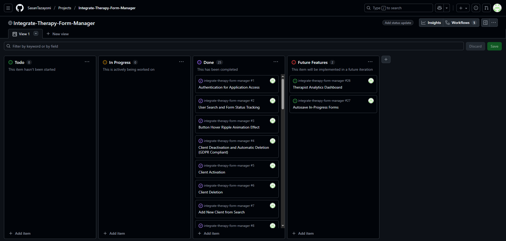

## GitHub Issues

GitHub Issues served as an another Agile tool. There, I used my own **User Story Template** to manage user stories. It also helped with milestone iterations on a weekly basis.

- [Open Issues](https://github.com/SasanTazayoni/integrate-therapy-form-manager/issues)

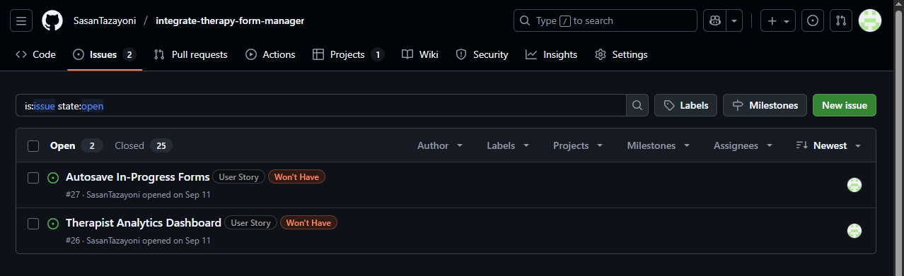

- [Closed Issues](https://github.com/SasanTazayoni/integrate-therapy-form-manager/issues?q=is%3Aissue%20state%3Aclosed)


### MoSCoW Prioritization

I've decomposed my Epics into stories prior to prioritizing and implementing them.
Using this approach, I was able to apply the MoSCow prioritization and labels to my user stories within the Issues tab.

- **Must Have**: guaranteed to be delivered (*max 60% of stories*)
- **Should Have**: adds significant value, but not vital (*the rest ~20% of stories*)
- **Could Have**: has small impact if left out (*20% of stories*)
- **Won't Have**: not a priority for this iteration

# Testing

## Lighthouse Audit

I've tested my deployed project using the Lighthouse Audit tool to check for any major issues.

| Page | Mobile | Desktop | Notes |
| --- | --- | --- | --- |
| Dashboard | 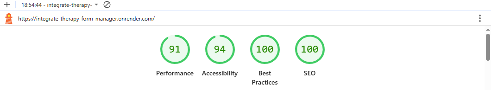 | 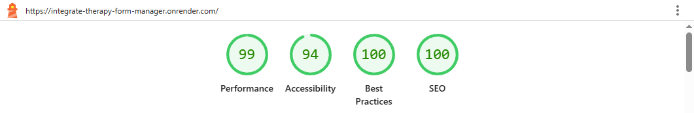 | No warnings |
| Form results summary | 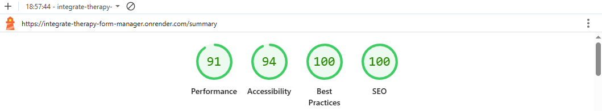 | 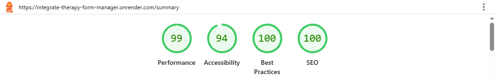 | No warnings |
| YSQ | 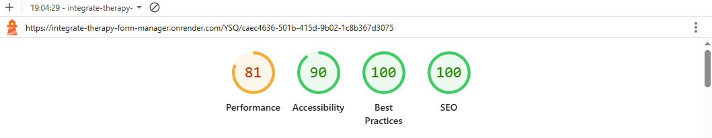 | 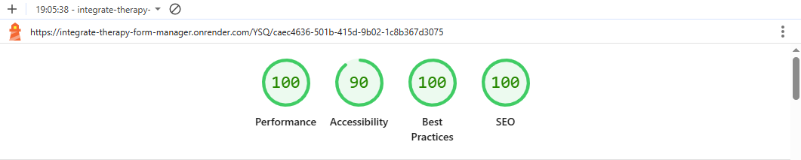 | No warnings |
| SMI | 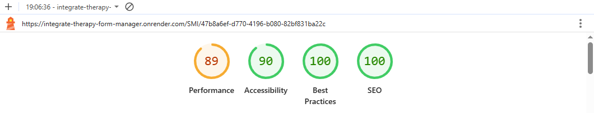 |  | No warnings |
| BDI | 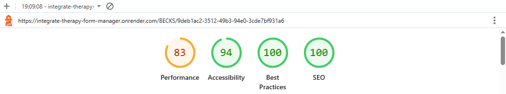 | 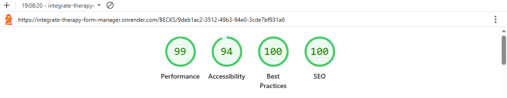 | No warnings |
| BAI | 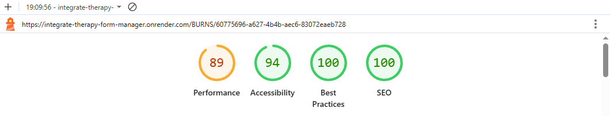 | 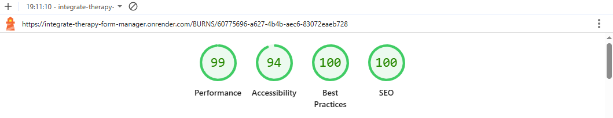 | No warnings |

## Automated Testing

I have conducted a series of automated tests on my application.

### JavaScript (Unit Testing)

I have used Vitest, a fast unit testing framework for Vite projects, to test the application functionality.

In order to run the tests, I ran the following command in the terminal each time:

```npm run test```

To create the coverage report, I would then run the following command:

```npm run test -- --coverage```

Below are the results from all the files on my application that I've tested:

Frontend:

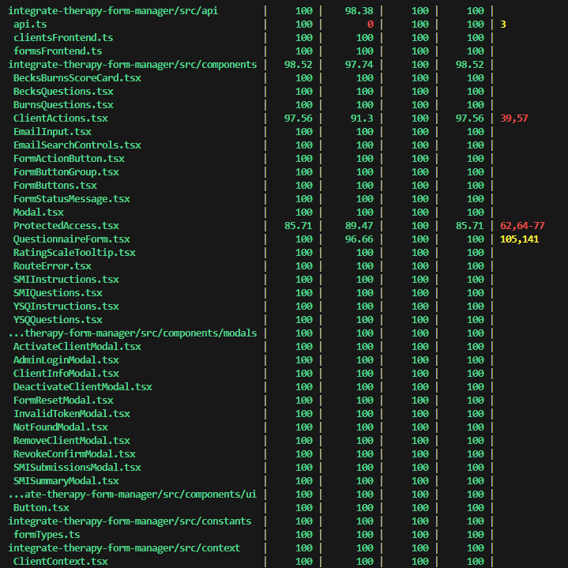 <br>
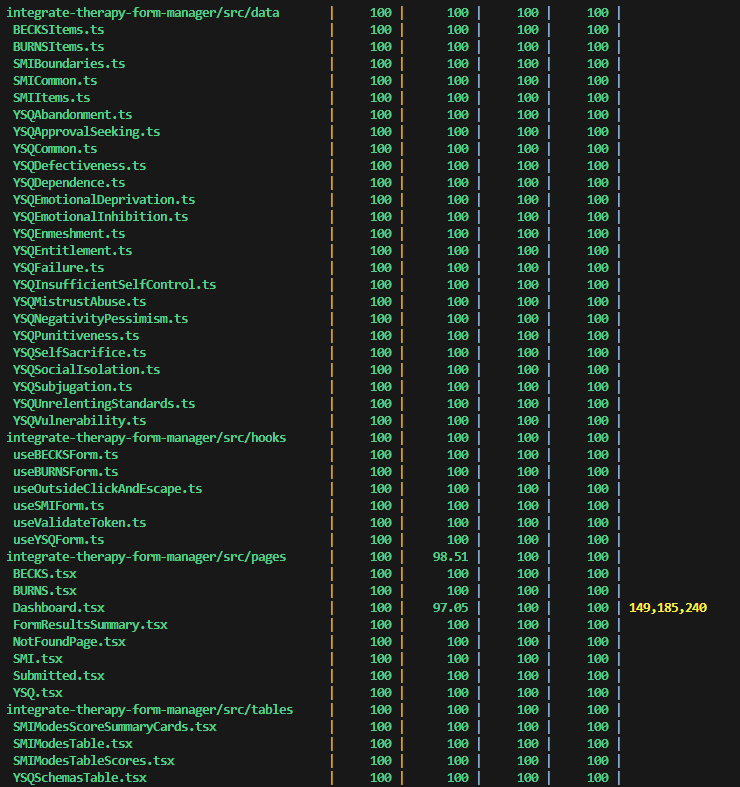 <br>
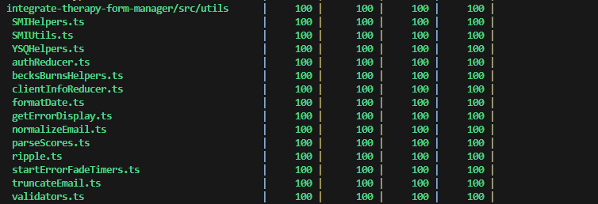 <br>

Backend:

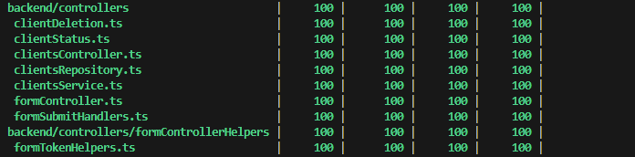 <br>
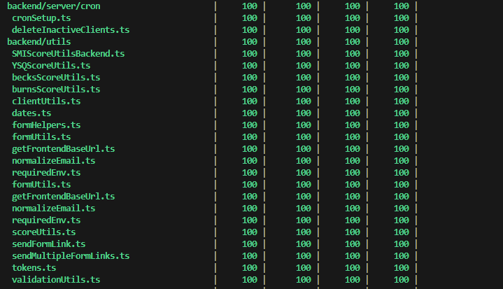 <br>

# Deployment

## Node JS

1. Go to the node [website](https://nodejs.org/en).
2. Click on the "DOWNLOAD" tab at the top of the page.
3. Click on the appropriate installer for your operating system (in my case it is Windows) and this will download node to your computer.
4. Open the downloaded file and run the installation.
5. Follow through the instructions, clicking "next" where necessary and accepting the terms.
6. When the installation is complete, node.js will be installed into your computer.
7. You can check your version of node in a terminal by typing in "node -v".
8. Type "NPM init -y" to create a JSON package that will keep a record of the installation dependencies required for the project.

## PostgreSQL Database

This project uses a [Neon Database](http://neon.tech/).

To obtain your own Postgres Database, sign-up with your GitHub account, then follow these steps:

- Decide a project name (this is commonly the name of the project: integrate-therapy-form-manager) and a database name and fill in the fields.
- Pick the version of Postgres that you would like from the drop-down menu.
- Pick the region that is closest to you from the drop-down menu.
- Click **Create Project**.
- You can now connect to the database using the API provided.

### Environment variables

Store these in your project .env (or secret manager):

```DATABASE_URL=postgresql:XXXXXXXXXXXXX```

## Resend API

This project uses Resend to handle sending transactional emails (account verification, purchase confirmations, etc.).
Once you've created a Resend account and logged in, follow these steps to connect your Node server:

* Log in to your Resend dashboard at Resend.
* Go to API Keys (or Settings → API keys) and create a new API key.
* Copy the key immediately — you will not be able to view the full key again after creation.
  * Save this somewhere secure (local ```.env```, secrets manager, etc.) and do not commit it to source control.
  * ```RESEND_API_KEY``` = your Resend API key (e.g. ```re_xxxxxxxxxxxxx```)
* (Recommended) Verify a sending domain:
  * In the dashboard, go to Domains → Add Domain (e.g., yourdomain.com).
  * Add the DNS records Resend provides (SPF/TXT, DKIM) with your DNS provider. [Instructions here](https://resend.com/docs/send-with-smtp)
  * Wait for propagation and confirm verification in the Resend dashboard — verified domains improve deliverability.
 
### Environment variables

Store these in your project .env (or secret manager):

```RESEND_API_KEY=re_xxxxxxxxxxxxxxxxx```
```EMAIL_FROM="Your Name <noreply@yourdomain.com>"```

Install the Node SDK by running ```npm install resend```.

## Render Deployment

This project uses [Render](https://render.com/), a platform as a service (PaaS) that enables developers to build, run, and operate applications entirely in the cloud.

Deployment steps are as follows, after account setup (including workspace setup):

### Backend

* Select "Projects" which should open a page to select a service.
* Click the "+ New" button in the top right corner.
* Select "New Web Service" for the backend.
* Connect to your Git provider (Github in my case) and then to the repository (e.g. https://github.com/SasanTazayoni/integrate-therapy-form-manager in my case).
* Give a unique name for the static site (should be different to the frontend site name).
* Set the Region to one that is closest to you.
* Set the "Root Directory" to the name of the folder which contains the backend file (in my case it is "backend").
* Set the "Start Command" to "npm run start".
* Set the following Environment Variables:
  * DATABASE_URL = [YOUR DATABASE API KEY]
  * FROM_EMAIL = [Your email <youremail@yourdomain.com>]
  * FRONTEND_BASE_URL = [NAME OF FRONTEND SERVER]
  * RESEND_API_KEY = [YOUR RESEND API KEY]

### Frontend

* Click the "+ New" button in the top right corner again.
* Select "New Static Site" for the frontend.
* Connect to your Git provider (Github in my case) and then to the repository (e.g. https://github.com/SasanTazayoni/integrate-therapy-form-manager in my case).
* Give a unique name for the static site (usually autofilled).
* Set the Publish Directory as "dist".
* Set the following Environment Variables:
  * VITE_API_URL = [NAME OF BACKEND SERVER]
  * VITE_BASE_PATH = /
  * VITE_THERAPIST_USERNAME = [DECIDE A USERNAME]
  * VITE_THERAPIST_PASSWORD = [DECIDE A PASSWORD]
* Click "Deploy Static Site" which will deploy the frontend from the latest commit.
* On the left sidebar menu, click the "Redirects/Rewrites" tab.
* Under "Source" add "/*", under "Destination" add "/index.html", under "Action" add "Rewrite".

The application should be accessible via the frontend URL when both the frontend and backend are hosted.

## Local deployment

This project can be cloned or forked in order to make a local copy on your own system.

For either method, you will need to install any applicable packages found within the *package.json* file.

- `npm install`.

You will need to create a new file called `.env` at the root-level of the frontend folder and backend folder, and include the same environment variables listed above from the Render deployment steps.

> [!IMPORTANT]  
> This is a sample only; you would replace the values with your own if cloning/forking my repository.

Sample `.env` file (frontend):

* ```VITE_THERAPIST_USERNAME=yourusername```
* ```VITE_THERAPIST_PASSWORD=yourpassword```
* ```VITE_API_URL=/```
* ```VITE_BASE_PATH=/integrate-therapy-form-manager```

Sample `.env` file (backend):

* ```DATABASE_URL='yourdatabaseurl'```
* ```RESEND_API_KEY="yourresendapikey"```
* ```FROM_EMAIL="Your email <youremail@yourdomain.com>"```
* ```FRONTEND_BASE_URL="yourfrontendservername"```

Local environment only (do not include these in production/deployment!)

Once the project is cloned or forked, in order to run it locally, you'll need to follow these steps:

* Open a terminal and change directories into the frontend folder.
* Type "npm run dev" which should build then run the frontend server.
* Open a second terminal and change directories into the backend folder.
* Before running the backend, make sure your database is properly migrated using Prisma:
  * Type npx prisma migrate dev --name init which will apply the latest Prisma schema changes to your local database.
* Type "npm run dev" which should build then run the backend server.
* Both of these can be stopped with `CTRL+C`.

In the production version the frontend is served via the backend therefore in order to run it locally, ```src/api/api.ts``` can be deleted, ```‎src/api/clientsFrontend.ts``` and ```‎src/api/formsFrontend.ts``` should be replaced respectively with these files:

```ts
import axios from "axios";
import { getErrorDisplay } from "../utils/getErrorDisplay";
import type { ClientFormsStatus } from "../types/formStatusTypes";

export type Client = {
  id: string;
  name: string;
  email: string;
};

type FetchClientStatusResult =
  | { ok: true; data: ClientFormsStatus }
  | { ok: false; data: { error: string } };

type AddClientResult =
  | { ok: true; data: ClientFormsStatus }
  | { ok: false; data: { error: string } };

export async function fetchClientStatus(
  email: string
): Promise<FetchClientStatusResult> {
  try {
    const res = await axios.get<ClientFormsStatus>("/clients/form-status", {
      params: { email },
    });
    return { ok: true, data: res.data };
  } catch (err: unknown) {
    if (axios.isAxiosError(err)) {
      return {
        ok: false,
        data: {
          error: getErrorDisplay(
            err,
            "Network error while fetching client status."
          ),
        },
      };
    }
    return {
      ok: false,
      data: {
        error: "An unexpected error occurred while fetching client status.",
      },
    };
  }
}

export async function addClient(email: string): Promise<AddClientResult> {
  try {
    const res = await axios.post<ClientFormsStatus>("/clients/add", { email });
    return { ok: true, data: res.data };
  } catch (err: unknown) {
    if (axios.isAxiosError(err)) {
      return {
        ok: false,
        data: {
          error: getErrorDisplay(err, "Network error while adding client."),
        },
      };
    }
    return {
      ok: false,
      data: {
        error: "An unexpected error occurred while adding client.",
      },
    };
  }
}

type DeleteClientResult =
  | { ok: true; data: { message: string } }
  | { ok: false; data: { error: string } };

export async function deleteClient(email: string): Promise<DeleteClientResult> {
  try {
    const res = await axios.delete<{ message: string }>(`/clients/by-email`, {
      params: { email },
    });
    return { ok: true, data: res.data };
  } catch (err: unknown) {
    if (axios.isAxiosError(err)) {
      return {
        ok: false,
        data: {
          error: getErrorDisplay(err, "Network error while deleting client."),
        },
      };
    }
    return {
      ok: false,
      data: {
        error: "An unexpected error occurred while deleting client.",
      },
    };
  }
}

export async function deleteClientByEmail(
  email: string
): Promise<DeleteClientResult> {
  return await deleteClient(email);
}

type DeactivateClientResponse = {
  message: string;
  client: {
    id: string;
    email: string;
    name: string;
    status: string;
    inactivated_at: string | null;
    delete_inactive: string | null;
  };
};

type DeactivateClientResult =
  | { ok: true; data: DeactivateClientResponse }
  | { ok: false; data: { error: string } };

export async function deactivateClient(
  email: string
): Promise<DeactivateClientResult> {
  try {
    const res = await axios.patch<DeactivateClientResponse>(
      "/clients/deactivate",
      null,
      { params: { email } }
    );
    return { ok: true, data: res.data };
  } catch (err: unknown) {
    if (axios.isAxiosError(err)) {
      return {
        ok: false,
        data: {
          error: getErrorDisplay(
            err,
            "Network error while deactivating client."
          ),
        },
      };
    }
    return {
      ok: false,
      data: {
        error: "An unexpected error occurred while deactivating client.",
      },
    };
  }
}

type ActivateClientResponse = {
  message: string;
  client: {
    id: string;
    email: string;
    name: string;
    status: string;
    inactivated_at: string | null;
    delete_inactive: string | null;
  };
};

type ActivateClientResult =
  | { ok: true; data: ActivateClientResponse }
  | { ok: false; data: { error: string } };

export async function activateClient(
  email: string
): Promise<ActivateClientResult> {
  try {
    const res = await axios.patch<ActivateClientResponse>(
      "/clients/activate",
      null,
      { params: { email } }
    );
    return { ok: true, data: res.data };
  } catch (err: unknown) {
    if (axios.isAxiosError(err)) {
      return {
        ok: false,
        data: {
          error: getErrorDisplay(err, "Network error while activating client."),
        },
      };
    }
    return {
      ok: false,
      data: {
        error: "An unexpected error occurred while activating client.",
      },
    };
  }
}
```

```ts
import axios from "axios";
import { getErrorDisplay } from "../utils/getErrorDisplay";

type SchemaCodes =
  | "ed"
  | "ab"
  | "ma"
  | "si"
  | "ds"
  | "fa"
  | "di"
  | "vu"
  | "eu"
  | "sb"
  | "ss"
  | "ei"
  | "us"
  | "et"
  | "is"
  | "as"
  | "np"
  | "pu";

type Scores = Partial<{
  [K in SchemaCodes as `ysq_${K}_answers`]: number[];
}>;

export async function sendFormToken(email: string, formType: string) {
  try {
    const res = await axios.post(`/forms/send-token/${formType}`, { email });
    return { ok: true, data: res.data };
  } catch (err: unknown) {
    if (axios.isAxiosError(err)) {
      return {
        ok: false,
        data: {
          error: getErrorDisplay(
            err,
            "Network error while sending form token."
          ),
        },
      };
    }
    return {
      ok: false,
      data: {
        error: "Unexpected error occurred.",
      },
    };
  }
}

export async function sendMultipleFormTokens(email: string) {
  try {
    const res = await axios.post("/forms/send-multiple", { email });
    return { ok: true, data: res.data };
  } catch (err: unknown) {
    if (axios.isAxiosError(err)) {
      return {
        ok: false,
        data: {
          error: getErrorDisplay(
            err,
            "Network error while sending multiple form tokens."
          ),
        },
      };
    }
    return {
      ok: false,
      data: {
        error: "Unexpected error occurred.",
      },
    };
  }
}

export async function validateFormToken(token: string) {
  try {
    const res = await axios.get("/forms/validate-token", {
      params: { token },
    });

    return { ok: true, data: res.data };
  } catch (err: unknown) {
    if (axios.isAxiosError(err)) {
      return {
        ok: false,
        error: getErrorDisplay(err, "Unknown error validating token"),
      };
    }
    return {
      ok: false,
      error: "Unexpected error occurred.",
    };
  }
}

export async function revokeFormToken(email: string, formType: string) {
  try {
    const res = await axios.post(`/forms/revoke-token/${formType}`, { email });
    return { ok: true, data: res.data };
  } catch (err: unknown) {
    if (axios.isAxiosError(err)) {
      return {
        ok: false,
        data: {
          error: getErrorDisplay(
            err,
            "Network error while revoking form token."
          ),
        },
      };
    }
    return {
      ok: false,
      data: {
        error: "Unexpected error occurred.",
      },
    };
  }
}

export async function submitBecksForm({
  token,
  result,
}: {
  token: string;
  result: string;
}) {
  try {
    const res = await axios.post("/forms/submit/becks", { token, result });
    return { ok: true, data: res.data };
  } catch (err: unknown) {
    if (axios.isAxiosError(err)) {
      const code = err?.response?.data?.code;
      const message = getErrorDisplay(
        err,
        "Network error while submitting form."
      );

      return {
        ok: false,
        error: message,
        code,
      };
    }
    return {
      ok: false,
      error: "Unexpected error occurred.",
    };
  }
}

export async function submitBurnsForm({
  token,
  result,
}: {
  token: string;
  result: string;
}) {
  try {
    const res = await axios.post("/forms/submit/burns", { token, result });
    return { ok: true, data: res.data };
  } catch (err: unknown) {
    if (axios.isAxiosError(err)) {
      const code = err?.response?.data?.code;
      const message = getErrorDisplay(
        err,
        "Network error while submitting form."
      );

      return {
        ok: false,
        error: message,
        code,
      };
    }
    return {
      ok: false,
      error: "Unexpected error occurred.",
    };
  }
}

export async function submitYSQForm({
  token,
  scores,
}: {
  token: string;
  scores: Scores;
}) {
  try {
    const res = await axios.post("/forms/submit/ysq", {
      token,
      scores,
    });

    return { ok: true, data: res.data };
  } catch (err: unknown) {
    if (axios.isAxiosError(err)) {
      const code = err?.response?.data?.code;
      const message = getErrorDisplay(
        err,
        "Network error while submitting YSQ form."
      );

      return { ok: false, error: message, code };
    }
    return { ok: false, error: "Unexpected error occurred." };
  }
}

export async function submitSMIForm({
  token,
  results,
}: {
  token: string;
  results: Record<string, { average: number; label: string }>;
}) {
  try {
    const res = await axios.post("/forms/submit/smi", {
      token,
      results,
    });

    return { ok: true, data: res.data };
  } catch (err: unknown) {
    if (axios.isAxiosError(err)) {
      const code = err?.response?.data?.code;
      const message = getErrorDisplay(
        err,
        "Network error while submitting SMI form."
      );

      return { ok: false, error: message, code };
    }
    return { ok: false, error: "Unexpected error occurred." };
  }
}

export async function updateClientInfo({
  token,
  name,
  dob,
}: {
  token: string;
  name: string;
  dob: string;
}) {
  try {
    await axios.post("/forms/update-client-info", { token, name, dob });
    return { ok: true };
  } catch (err: unknown) {
    if (axios.isAxiosError(err)) {
      return {
        ok: false,
        error: getErrorDisplay(err, "Unknown error updating client info"),
      };
    }
    return {
      ok: false,
      error: "Unexpected error occurred.",
    };
  }
}

export type SmiForm = {
  id: string;
  submittedAt: string;
  smiScores: Record<string, string | null>;
};

export type FetchAllSmiFormsResult = {
  ok: boolean;
  data: {
    clientName?: string | null;
    smiForms?: SmiForm[];
    error?: string;
  };
};

export async function fetchAllSmiForms(
  email: string
): Promise<FetchAllSmiFormsResult> {
  try {
    const res = await axios.get<{
      clientName: string | null;
      smiForms: SmiForm[];
    }>("/forms/smi/all", { params: { email } });
    return { ok: true, data: res.data };
  } catch (err: unknown) {
    if (axios.isAxiosError(err)) {
      return {
        ok: false,
        data: {
          error: getErrorDisplay(
            err,
            "Network error while fetching SMI forms."
          ),
        },
      };
    }
    return {
      ok: false,
      data: { error: "An unexpected error occurred while fetching SMI forms." },
    };
  }
}
```

### Cloning

You can clone the repository by following these steps:

1. Go to the [GitHub repository](https://github.com/SasanTazayoni/integrate-therapy-form-manager) 
2. Locate the Code button above the list of files and click it 
3. Select if you prefer to clone using HTTPS, SSH, or GitHub CLI and click the copy button to copy the URL to your clipboard
4. Open Git Bash or Terminal
5. Change the current working directory to the one where you want the cloned directory
6. In your IDE Terminal, type the following command to clone my repository:
	- `git clone https://github.com/SasanTazayoni/integrate-therapy-form-manager.git`
7. Press Enter to create your local clone.

### Forking

By forking the GitHub Repository, we make a copy of the original repository on our GitHub account to view and/or make changes without affecting the original owner's repository.
You can fork this repository by using the following steps:

1. Log in to GitHub and locate the [GitHub Repository](https://github.com/SasanTazayoni/integrate-therapy-form-manager)
2. At the top of the Repository (not top of page) just above the "Settings" Button on the menu, locate the "Fork" Button.
3. Once clicked, you should now have a copy of the original repository in your own GitHub account!
